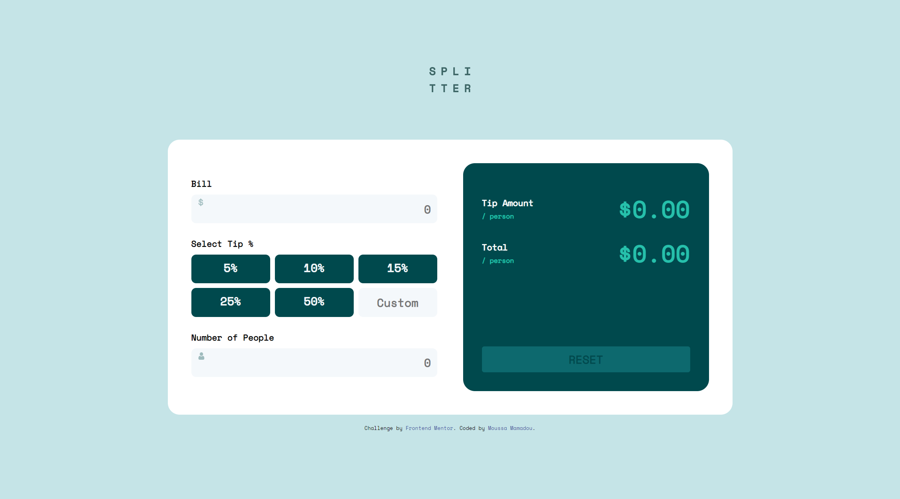

# Frontend Mentor - Tip calculator app solution

This is a solution to the [Tip calculator app challenge on Frontend Mentor](https://www.frontendmentor.io/challenges/tip-calculator-app-ugJNGbJUX). Frontend Mentor challenges help you improve your coding skills by building realistic projects.

## Overview

### The challenge

Users should be able to:

- View the optimal layout for the app depending on their device's screen size
- See hover states for all interactive elements on the page
- Calculate the correct tip and total cost of the bill per person

### Screenshot

### Links

- Solution URL: [Add solution URL here](https://moussamamadou.github.io/tip-calculator-app/)

## My process

### Built with

- HTML/CSS 
- SASS
- Vanilla Javascript

### What I learned

It was a good challenge to comeback in front-end developpement. It helped me pratice my CSS and Javascript skills.

## Author

- Website - [Moussa Mamadou](http://www.moussamamadou.com)
- Frontend Mentor - [@moussamamadou](https://www.frontendmentor.io/profile/moussamamadou)

